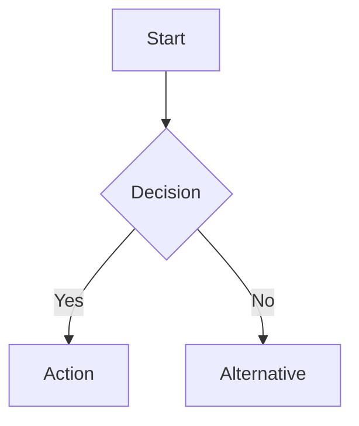

# Documentation Standards

**Created:** 2026-04-08 12:17 GMT+1  
**Author:** DOC (Documentation Specialist)  
**Status:** ✅ Active  
**Applies To:** All Zeta documentation

## 📋 Overview

This document establishes standards for Zeta language documentation to ensure consistency, quality, and maintainability across all documentation.

## 🎯 Goals

1. **Consistency:** Uniform style and structure
2. **Clarity:** Understandable by target audience
3. **Completeness:** All features documented
4. **Accuracy:** Matches actual implementation
5. **Maintainability:** Easy to update and extend

## 📁 Documentation Structure

### **1. Directory Layout**
```
docs/
├── system-docs/          # Core system documentation
├── guides/              # Tutorials and how-tos
├── reference/           # API reference
├── examples/           # Runnable code examples
├── architecture/       # Design and architecture
└── CONTRIBUTING.md     # Documentation contribution guide
```

### **2. File Naming Convention**
- **Lowercase with hyphens:** `error-handling-system.md`
- **Descriptive names:** Clear from filename alone
- **Consistent extensions:** Always `.md` for Markdown

## 📝 Documentation Format

### **1. File Header**
Every documentation file MUST start with:

```markdown
# Title

**Last Updated:** YYYY-MM-DD HH:MM Timezone  
**System:** System Name (Related Components)  
**Status:** ✅ Complete / 🚧 In Progress / ⏳ Planned  
**Examples:** X+ runnable code examples
```

### **2. Section Structure**
```
# Title
## 📋 Overview
## 🎯 Core Concepts
## 📚 Reference
## 🛠️ Usage Patterns
## 🔧 Advanced Features
## 📝 Best Practices
## 🧪 Testing
## 🔍 Troubleshooting
## 📈 Performance
## 🚨 Limitations
## 🔮 Future
```

### **3. Code Examples**
```markdown
**Example:**
```zeta
// Clear, runnable example
fn example() {
    println!("Hello, World!");
}
```

**Explanation:**
- What the example demonstrates
- Key points to notice
- Expected output
```

## 🎨 Writing Style

### **1. Tone and Voice**
- **Professional but approachable**
- **Active voice:** "The system does X" not "X is done by the system"
- **Second person:** "You can use this feature" not "One can use this feature"
- **Confident:** "This will work" not "This should work"

### **2. Terminology**
- **Consistent:** Use same terms throughout
- **Defined:** Define technical terms on first use
- **Accurate:** Match implementation terminology

### **3. Examples**
- **Runnable:** All examples should compile and run
- **Simple:** Start with simplest case
- **Progressive:** Build complexity gradually
- **Commented:** Explain non-obvious parts

## 🔧 Technical Requirements

### **1. Accuracy**
- ✅ All code examples must compile
- ✅ All descriptions must match implementation
- ✅ All API references must be correct
- ✅ All version compatibility must be specified

### **2. Completeness**
- ✅ Document all public APIs
- ✅ Document all configuration options
- ✅ Document all error conditions
- ✅ Document all edge cases

### **3. Clarity**
- ✅ One concept per section
- ✅ Progressive disclosure of complexity
- ✅ Visual aids where helpful (tables, diagrams)
- ✅ Cross-references to related topics

## 🛠️ Documentation Tools

### **1. Markdown Extensions**
```markdown
<!-- Use standard Markdown with these extensions: -->

**Emphasis:** Use for UI elements, file names
`Code:` Use for code snippets, commands
```zeta Code blocks: Use for Zeta code
> Blockquotes: Use for notes, warnings, tips

<!-- Special sections: -->
**Note:** Additional information
**Warning:** Potential issues
**Tip:** Helpful suggestions
**Example:** Code examples
```

### **2. Diagrams and Visuals**
```markdown
<!-- Use Mermaid for diagrams when helpful: -->


<!-- Use tables for comparisons: -->
| Feature | Description | Example |
|---------|-------------|---------|
| Option A | Does X | `example_a()` |
| Option B | Does Y | `example_b()` |
```

### **3. Cross-references**
```markdown
<!-- Link to other documentation: -->
See [Error Handling](./error-handling-system.md) for details.

<!-- Link to source code: -->
Implementation: [`src/parser/mod.rs`](../../src/parser/mod.rs)

<!-- Link to external resources: -->
[Zeta GitHub](https://github.com/murphsicles/zeta)
```

## 🧪 Quality Assurance

### **1. Review Checklist**
Before committing documentation, verify:

- [ ] File header complete and accurate
- [ ] All examples compile and run
- [ ] No broken links
- [ ] Consistent terminology
- [ ] Correct spelling and grammar
- [ ] Proper formatting
- [ ] Appropriate cross-references
- [ ] Version compatibility noted

### **2. Testing Documentation**
```bash
# Test all code examples
zeta test-docs --path docs/

# Check links
zeta check-links --path docs/

# Validate structure
zeta validate-docs --path docs/
```

### **3. Update Procedures**
1. **When code changes:** Update documentation immediately
2. **When adding features:** Document before merging
3. **Regular review:** Quarterly documentation audit
4. **Version updates:** Update compatibility notes

## 📈 Documentation Metrics

### **1. Quantitative Metrics**
- **Coverage:** Percentage of public APIs documented
- **Examples:** Number of runnable examples
- **Freshness:** Days since last update
- **Completeness:** Sections with required content

### **2. Qualitative Metrics**
- **Clarity score:** Reader comprehension
- **Accuracy score:** Match with implementation
- **Usefulness score:** Helpfulness for tasks
- **Structure score:** Logical organization

## 🔄 Maintenance

### **1. Regular Updates**
- **Weekly:** Fix reported issues
- **Monthly:** Update for minor changes
- **Quarterly:** Comprehensive review
- **Annually:** Major restructuring if needed

### **2. Version Compatibility**
```markdown
**Compatibility:**
- ✅ Zeta v0.5.0+
- ⚠️ Partial support in v0.4.x
- ❌ Not available before v0.4.0

**Migration Notes:**
- Changed in v0.5.0: New syntax
- Deprecated in v0.4.2: Old method
- Removed in v0.5.0: Legacy feature
```

### **3. Deprecation Policy**
1. **Mark deprecated:** Add deprecation notice
2. **Provide alternative:** Show new way to do it
3. **Timeline:** Specify removal version
4. **Update examples:** Use new approach

## 🤝 Contribution Guidelines

### **1. Getting Started**
1. Fork the repository
2. Create a feature branch
3. Make changes following standards
4. Test documentation
5. Submit pull request

### **2. Pull Request Requirements**
- **Title:** `[DOC] Brief description`
- **Description:** What changed and why
- **Testing:** Evidence examples work
- **Review:** Request documentation review

### **3. Review Process**
1. **Automated checks:** Examples compile, links work
2. **Technical review:** Accuracy with implementation
3. **Editorial review:** Clarity and style
4. **Approval:** Two reviewers minimum

## 🚨 Emergency Procedures

### **1. Critical Errors**
If documentation contains:
- **Security vulnerabilities:** Remove immediately
- **Dangerous examples:** Replace with safe ones
- **Major inaccuracies:** Correct urgently
- **Broken builds:** Fix immediately

### **2. Rollback Procedures**
```bash
# Revert documentation changes
git revert <commit-hash>

# Or restore from backup
git checkout <backup-branch> -- docs/
```

## 📊 Success Criteria

### **1. Documentation is considered successful when:**
- ✅ 100% of public APIs documented
- ✅ All examples compile and run
- ✅ No broken links
- ✅ Consistent style throughout
- ✅ Helpful for beginners and experts
- ✅ Regularly updated
- ✅ Positive user feedback

### **2. Documentation fails when:**
- ❌ Examples don't compile
- ❌ Information is incorrect
- ❌ Structure is confusing
- ❌ Not updated with code
- ❌ Missing critical information
- ❌ Negative user feedback

---

**Good documentation transforms code into understanding. Follow these standards to create documentation that helps users succeed with Zeta.**

*These standards are living documents. Update as needed to improve documentation quality.*