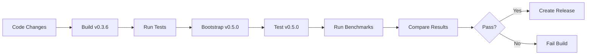

# 🧪 TEST INTEGRATION PLAN
## Connecting Bench Tests & Regression Tests for Zeta v0.5.0

## 📊 CURRENT TEST ASSETS INVENTORY

### **1. Benchmarks (`benches/`)**
- `FULL_BENCHMARK.z` - Comprehensive performance tests
- `hashmap_bench.z` - HashMap operation benchmarks
- `match_performance.z` - Match expression performance
- `memory_bench.z` - Memory & cache benchmarks
- `OPTIMIZED_BENCHMARK.z` - Optimization-specific tests

### **2. Test Suites (`tests/`)**
- **`unit/`** (4 files) - Individual component tests
- **`integration/`** (4 files) - Cross-component tests
- **`regression/`** (0 files) - *Needs population*
- **`fuzz/`** (0 files) - *Needs population*

### **3. Verification (`verify/`)**
- `build/` - Build verification
- `file_state/` - File integrity checks
- `recovery/` - Recovery system tests
- `system/` - System integration tests

## 🎯 TEST INTEGRATION STRATEGY

### **Phase 1: Baseline Testing (Pre-Bootstrap)**
**Goal:** Establish performance baseline before v0.5.0 bootstrap

```bash
# 1. Run existing Zeta benchmarks (when compiler works)
zetac.exe bench benches/FULL_BENCHMARK.z

# 2. Run unit tests
zetac.exe test tests/unit/

# 3. Run integration tests  
zetac.exe test tests/integration/
```

### **Phase 2: Bootstrap Verification**
**Goal:** Verify v0.5.0 compiler works correctly

```bash
# 1. Compile v0.5.0 source
zetac-v0.3.6.exe compile src/ -o zetac-v0.5.0.exe

# 2. Test the new compiler can compile itself
zetac-v0.5.0.exe compile src/ -o zetac-v0.5.0-v2.exe

# 3. Compare binaries (should be identical or very similar)
```

### **Phase 3: Regression Testing**
**Goal:** Ensure no functionality lost in bootstrap

```bash
# 1. Run all tests with v0.5.0 compiler
zetac-v0.5.0.exe test tests/unit/
zetac-v0.5.0.exe test tests/integration/

# 2. Run benchmarks with v0.5.0 compiler
zetac-v0.5.0.exe bench benches/FULL_BENCHMARK.z

# 3. Compare results with v0.3.6 baseline
```

### **Phase 4: Performance Validation**
**Goal:** Verify v0.5.0 meets/exceeds performance targets

```bash
# Run comprehensive benchmark suite
zetac-v0.5.0.exe bench benches/OPTIMIZED_BENCHMARK.z

# Key metrics to track:
# - Compilation speed
# - Binary size
# - Runtime performance
# - Memory usage
```

## 🔧 TEST INFRASTRUCTURE NEEDED

### **1. Regression Test Suite (`tests/regression/`)**
**Purpose:** Catch regressions in future development

```z
# Example regression test structure
test/regression/
├── phase1/          # Basic language features
├── phase2/          # Type system features  
├── phase3/          # Advanced features (generics, traits, macros)
├── optimization/    # Optimization-specific tests
└── bug_fixes/       # Tests for specific bugs fixed
```

### **2. Fuzz Testing (`tests/fuzz/`)**
**Purpose:** Discover edge cases and crashes

```z
# Fuzz test categories needed:
# - Parser fuzzing (random valid/invalid syntax)
# - Type checker fuzzing (random type expressions)
# - Codegen fuzzing (random IR generation)
```

### **3. Continuous Integration**
**Purpose:** Automated testing on every change

```yaml
# GitHub Actions workflow needed:
# 1. Build v0.3.6 compiler
# 2. Run existing tests
# 3. Bootstrap v0.5.0
# 4. Run tests with v0.5.0
# 5. Run benchmarks
# 6. Compare with baseline
```

## 📈 BENCHMARK INTEGRATION PLAN

### **Current Benchmark Structure:**
```z
// benches/FULL_BENCHMARK.z
benchmark "HashMap Operations" {
    // Test hashmap insert/lookup/remove
}

benchmark "Match Performance" {
    // Test match expression speed
}

benchmark "Memory Operations" {
    // Test alloc/dealloc patterns
}
```

### **Integration Steps:**

1. **Document benchmark expectations** - What "good" performance looks like
2. **Create baseline measurements** - Run with v0.3.6 compiler
3. **Automate benchmark runs** - Script to run all benchmarks
4. **Add performance regression detection** - Fail CI if performance drops
5. **Create visualization** - Graph performance over time

### **Key Performance Indicators (KPIs):**
- **Compilation speed** (lines/second)
- **Binary size** (MB)
- **Runtime performance** (operations/second)
- **Memory usage** (peak MB)
- **Startup time** (ms)

## 🚨 CRITICAL TESTS FOR v0.5.0 BOOTSTRAP

### **Must Pass Before Release:**

1. **Self-compilation test** - v0.5.0 can compile itself
2. **Backwards compatibility** - v0.5.0 can compile v0.3.x code
3. **Phase 3 feature validation** - All advanced features work
4. **Performance parity** - At least as fast as v0.3.6
5. **Stability test** - Can run for extended periods without crashing

### **Test Commands:**
```bash
# 1. Self-compilation
./zetac-v0.5.0.exe compile src/ -o zetac-v0.5.0-test.exe
diff zetac-v0.5.0.exe zetac-v0.5.0-test.exe  # Should be similar

# 2. Backwards compatibility
./zetac-v0.5.0.exe compile examples/v0.3.x-code.z -o test.exe

# 3. Phase 3 features
./zetac-v0.5.0.exe test tests/phase3/

# 4. Performance
./zetac-v0.5.0.exe bench benches/ --compare-to v0.3.6

# 5. Stability
./stress-test.sh zetac-v0.5.0.exe  # Run for 24 hours
```

## 📝 TEST DOCUMENTATION NEEDED

### **1. Test Coverage Report**
- Which features are tested
- Which features need tests
- Test pass/fail rates

### **2. Performance Report**
- Baseline measurements
- Current measurements
- Trends over time

### **3. Regression Tracking**
- Known issues
- Fixed issues
- Open issues

### **4. Test Environment**
- Hardware specifications
- Software dependencies
- Configuration settings

## 🎯 IMMEDIATE ACTION ITEMS

### **Before Bootstrap:**
1. [ ] Document current benchmark expectations
2. [ ] Run baseline benchmarks (when compiler works)
3. [ ] Review existing test coverage
4. [ ] Identify critical missing tests

### **During Bootstrap:**
1. [ ] Verify self-compilation works
2. [ ] Run unit/integration tests with new compiler
3. [ ] Capture performance measurements

### **After Bootstrap:**
1. [ ] Compare performance with baseline
2. [ ] Run extended stability tests
3. [ ] Document any regressions
4. [ ] Plan test suite expansion

## 🔗 INTEGRATION WITH RELEASE PROCESS

### **Release Checklist:**
- [ ] All tests pass
- [ ] Benchmarks meet targets
- [ ] No performance regressions
- [ ] Self-compilation verified
- [ ] Documentation updated
- [ ] Release notes complete

### **Automated Release Pipeline:**


## 🏁 CONCLUSION

The test infrastructure exists but needs integration and expansion. The bootstrap of v0.5.0 provides an opportunity to:

1. **Establish solid baselines** for performance and correctness
2. **Build comprehensive test suite** for future development
3. **Create automated CI/CD pipeline** to prevent regressions
4. **Document performance characteristics** for community

**Success Criteria:** v0.5.0 passes all tests, meets performance targets, and can be used to develop future versions of Zeta.

*Test Integration Plan created: $(Get-Date -Format 'yyyy-MM-dd HH:mm') GMT*